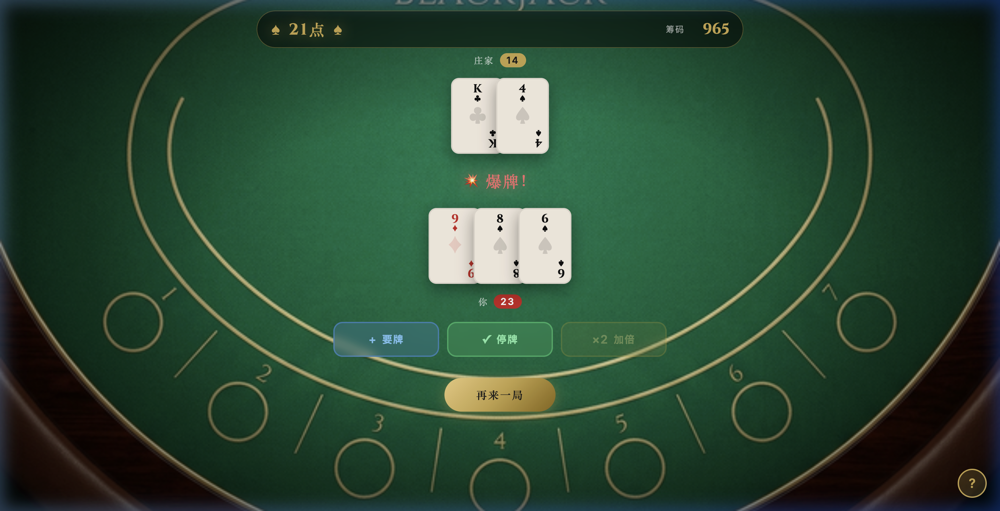

# 21点 MVP · 复盘报告

---

## 一、游戏结果展示




**已实现功能：**
- 标准21点完整玩法：Hit / Stand / Double Down / Blackjack 1.5x
- 庄家暗牌逻辑 + 自动补牌（< 17必须Hit）
- A弹性计算（1或11自动取最优）
- 筹码 + 下注系统，筹码归零自动重置
- 左上角「?」规则弹窗
- BGM 开关 + Jazz/Pop 双轨切换（顶部导航栏）
- 5种真实AI音效（翻牌/下注/胜利/爆牌/Blackjack）

---

## 二、AI 工具使用总览

| 工具 | 环节 | 用途 | 选择理由 |
|------|------|------|---------|
| **Antigravity** | 策划 + 代码 | 游戏设计、规则制定、全部 HTML/CSS/JS | 代码与设计在同一对话中联动，迭代速度最快 |
| **Nano Banana** | 美术 | 卡背图、赌场桌面背景图 | 直接内嵌在对话中生成，无需切换工具，支持风格描述 |
| **Suno AI** | 音乐 | 背景音乐（BGM_jazz / BGM_pop）| 擅长生成有氛围感的循环BGM，支持场景风格描述 |
| **ElevenLabs** | 音效 | 5个游戏音效（翻牌/下注/胜利/爆牌/BlackJack）| 文字生成音效最自然、响应快，免费额度足够MVP |

---

## 三、各环节 AI 贡献 vs. 人工补充

### 🎮 策划
- **AI完成**：玩法比较（麻将/扑克/21点）、方案选定、规则设计、赔率设置、功能边界制定
- **人工补充**：最终方案拍板（选择21点）、确认MVP范围（不做Split/Insurance）

### 🎨 美术
- **AI完成**：卡背图（深蓝金色几何花纹）、赌场桌面背景（生成即可用）
- **人工补充**：无——两张图一次生成即达到预期质量
- **注**：扑克牌正面采用CSS代码渲染，无需生成图片

### 💻 代码
- **AI完成**：全部代码（约1000行 HTML/CSS/JS），包含游戏状态机、发牌逻辑、A弹性计算、庄家AI、筹码系统、卡牌动画、音效集成、BGM播放器、规则面板
- **人工补充**：无直接编码，但用户通过指令驱动了4次关键修复（见下节）

### 🎵 音乐/音效
- **AI完成**：Suno 生成两首BGM风格曲目；ElevenLabs 生成5个音效文件
- **人工补充**：工具使用（用户自行去Suno/ElevenLabs生成并上传文件）、风格选择（Jazz vs Pop）

---

## 四、Bug & 用户指令驱动的迭代

| # | 问题 | 修复方式 |
|---|------|---------|
| 1 | 庄家暗牌未生效（第2张是明牌）| CSS 3D `rotateY` 跨浏览器渲染失效 → 改用 `display: none/block` |
| 2 | 规则面板重复（左上角 + 右下角各一个）| 删除右下角冗余版本 |
| 3 | 左上角规则样式与预期不符 | 改为「?」圆形按钮 + 点击弹出浮层 |
| 4 | 「再来一局」点击有音效（体验干扰）| 删除 `newRound()` 中的 `playSound('click')` |

> 所有问题均通过自然语言指令发现和描述，AI完成具体修复。用户无需读代码。

---

## 五、AI效果分析：哪里强，哪里一般

### ✅ AI效果最好的环节

**代码生成**
整个游戏逻辑一次性生成，结构清晰，状态机设计合理，A的弹性计算、庄家AI、筹码系统等细节均正确实现。从0到可运行MVP只用了一轮提示。

**美术资产**
两张图（卡背 + 桌面）一次生成即达到商用质量，风格统一（深绿赌场 + 金色元素），无需后期调整。

**方案规划**
AI能快速对比多个游戏方向，给出功能边界建议和技术方案，节省了大量前期调研时间。

### ⚠️ AI效果一般的环节

**CSS 跨浏览器兼容性**
庄家暗牌的3D翻转在特定浏览器下失效。AI生成的代码对浏览器兼容性边界不够敏感，需要用户实际测试才能发现。

**UI细节打磨**
规则面板的位置和样式需要多轮用户反馈才收敛，说明AI对"界面应该长什么样"的初始判断和用户预期存在差距，需要人来做最终审美判断。

---

## 六、人的价值：不可替代的地方

1. **方向决策**：最终选21点、选基础玩法，是人的判断
2. **质量感知**：发现庄家牌是明牌的视觉bug，需要人去实际玩游戏
3. **体验直觉**：「再来一局不要音效」是细节体验判断，AI不会主动提出
4. **工具选型执行**：Suno / ElevenLabs 的实际操作由人完成
5. **最终取舍**：哪些功能进MVP，是需要人主导的范围判断

---

## 七、如果再做一次，如何优化流程

| 环节 | 当前做法 | 改进建议 |
|------|---------|---------|
| 美术 | 随代码生成时一起生成 | 提前确认视觉风格再写代码，避免风格与代码脱节 |
| 音效 | 先程序合成，后替换真实文件 | 直接用ElevenLabs生成，省去中间步骤 |
| 测试 | 用户手动测试后口头反馈 | 建立测试清单（边界情况），系统性测试而非随机发现 |
| 代码结构 | 单文件 game.js | 后续拆分为 engine.js / ui.js / audio.js，便于扩展 |

### 🚀 下一步扩展路线

```
MVP（当前）→ Split分牌 → 统计面板（胜率/连胜）
           → Roguelite模式（Boss挑战 + 道具卡）
           → 移动端适配 → 联机对战
```

---

*本项目从0到MVP，全AI工具链协作，人工介入主要集中在决策和审查，无需手写一行代码。*
