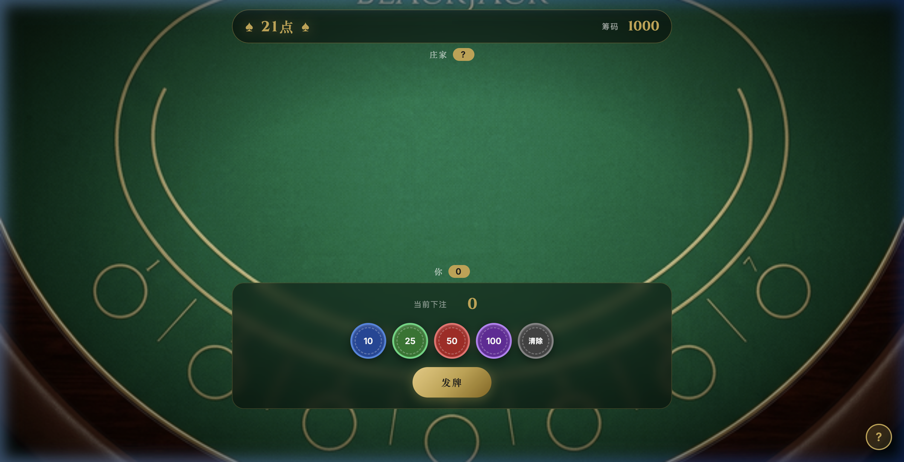
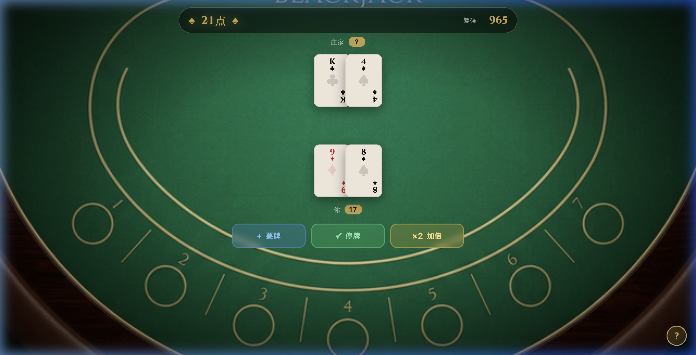

# 棋牌游戏项目复盘报告
本报告整合了"21点"和"斗地主"两个游戏的完整开发过程，分析了Coding Agent与人类在游戏开发中的协作模式、工具选择及流程优化建议。
---

## 一、游戏结果展示

### 21点游戏 (Blackjack)

**已实现功能：**
- 标准21点完整玩法：Hit（摸牌） / Stand（停牌） / Double Down（摸一张并加注，然后停牌） / Blackjack（21点，直接获胜，1.5倍赔率）
- 庄家暗牌逻辑 + 自动补牌（< 17必须摸牌）
- Ace牌，弹性计算（1或11自动取最优）
- 左上角「?」规则弹窗
- BGM开关 + Jazz/Pop 双轨切换
- 5种真实AI音效（翻牌/下注/胜利/爆牌/Blackjack）

### 斗地主游戏
**已实现功能：**
- 完整三人斗地主核心规则
- 叫分抢地主机制
- 合法牌型校验（顺子、连对、飞机、炸弹等）
- 记分结算系统
- **两大AI模式**：
  - **普通模式**：前端贪心算法引擎
  - **大师模式**：DeepSeek大语言模型决策，支持过往出牌情况分析

---

## 二、AI工具与选择依据

### 核心工具组合

| AI工具类别 | 项目工具 | 核心用途 | 选择理由 |
| :--- | :--- | :--- | :--- |
| **开发环境** | **Antigravity** | 谷歌开发的IDE，自带Coding Agent的扩展 | 可以访问本地文件系统，直接改写源码，运行终端命令 |
| **架构设计** | **Gemini 3.1 Pro** | 游戏的规则 & 逻辑架构、算法设计、UI/UX方案 | 超长上下文理解，确保设计整体性 |
| **代码生成** | **Claude Code** | HTML/CSS/JS/Python后端的核心逻辑编写 | 逻辑严密，代码质量高，支持复杂游戏流程 |
| **图像生成** | **Nano Banana** | 封面图、卡背、背景、头像素材 | 内嵌在Antigravity中，主流的图像生成模型 |
| **BGM生成** | **Suno AI** | 背景音乐创作 | 业内领先的AI音乐生成，节奏感强，循环效果佳 |
| **音效生成** | **ElevenLabs** | 游戏音效（翻牌/下注/胜利等） | 拟真度极高，文字转音效自然，响应快速 |
| **语音合成** | **Microsoft Edge TTS** | AI角色对话转换为语音（叫分、出牌、炸弹等台词） | 免费、无需 API Key、中文语音自然度高，支持多角色音色：云希使用 `zh-CN-YunxiNeural`（男声），晓伊使用 `zh-CN-XiaoyiNeural`（女声） |
| **AI玩家** | **DeepSeek** | 斗地主大师模式AI决策 | 中文优化好，成本适中，便于后续拓展出可以通过中文交互的AI玩家 |
---

## 三、各环节AI与人工分工全景

### 策划阶段
| AI完成工作 | 人工补充 |
| :--- | :--- |
| 玩法比较（麻将/扑克/21点）、规则设计、赔率设置、功能边界 | 选取21点和斗地主两个国外和国内最普遍的卡牌玩法 |

### 🎨 美术设计阶段
| AI核心能力 | 具体完成工作 | 人工创意指导 |
| :--- | :--- | :--- |
| **视觉素材生成** | • 21点：卡背图案、赌场桌面背景 • 斗地主：游戏封面、光效动画设计 | • 针对不同游戏风格设计生成Prompt • 赌场风格vs中式传统风格的视觉定位 |
| **界面元素设计** | • CSS扑克牌样式系统 • 按钮、界面布局基础设计 • 动画效果实现 | • 扑克牌格式优化和排版调整 • 字体大小、颜色一致性把控 • 用户界面美学判断 |

### 💻 代码开发阶段
| AI核心能力 | 具体完成工作 | 人工关键补充 |
| :--- | :--- | :--- |
| **核心逻辑架构** | • 21点：游戏状态机、A牌弹性计算、庄家自动补牌逻辑 • 斗地主：牌型判定、出牌合法性校验、积分结算系统 | • 业务规则校正：庄家明牌逻辑修复 • 规则完善：叫分递增规则验证 |
| **AI决策系统** | • 贪心策略算法实现 • LLM后端架构搭建 • API接口设计与异常处理 | • LLM Prompt工程设计 • 决策上下文构建策略 • 优化AI玩家上下文信息（过往出牌记录集成方案） |
| **交互系统** | • 筹码下注机制 • 按钮响应逻辑 • 游戏状态展示 | • 体验参数调优：AI思考时间、叫分停留 • 交互流程优化 • 节奏感把控 |

### 🎵 音效音乐阶段  
| AI生成能力 | 完成工作 | 人工创意指导 |
| :--- | :--- | :--- |
| **BGM创作** | 生成大厅、21点、斗地主三套风格化背景音乐 | 针对不同游戏设计音乐风格Prompt：赌场jazz风、中式传统风格 |
| **音效制作** | 翻牌、下注、胜利、爆牌、Blackjack等5类游戏音效 | 音效时机设计、音量平衡调试、用户体验优化 |
---